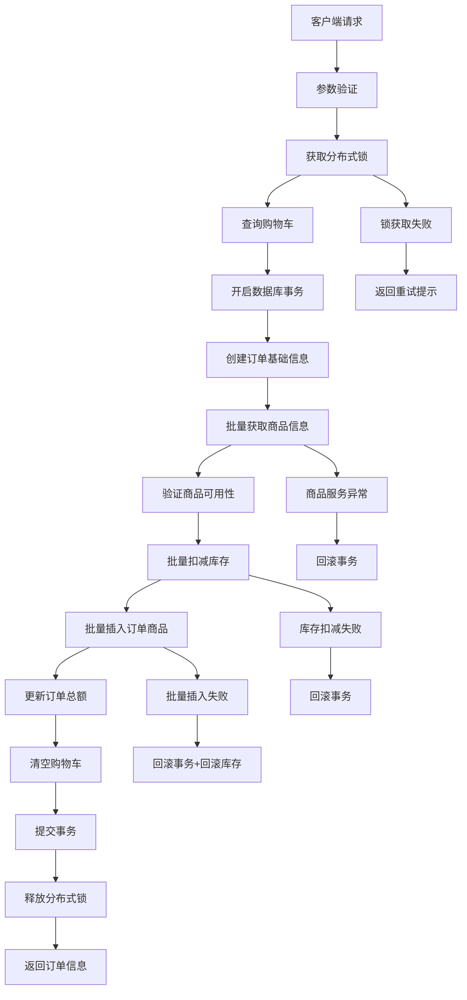

# 订单批量处理架构文档

## 概述

本文档详细说明了订单服务中订单创建的批量处理架构，包括分布式锁机制、跨服务调用优化和数据库批量操作的设计与实现。

## 架构设计

### 整体架构图



### 核心组件

#### 1. 分布式锁组件
- **实现方式**: 基于Redis的分布式锁
- **锁键格式**: `order_create_lock:{userId}`
- **锁定时长**: 30秒
- **重试机制**: 最多3次，间隔100ms

#### 2. 跨服务调用组件
- **商品服务**: 批量获取商品详情 (`BatchGetGoods`)
- **库存服务**: 批量扣减库存 (`Sell`)
- **异常处理**: 失败时自动回滚

#### 3. 数据库批量操作组件
- **批量插入**: 使用GORM的`CreateInBatches`
- **批量大小**: 100条记录
- **事务保护**: 全流程事务一致性

## 执行流程详解

### 1. 预处理阶段
```go
// 参数验证
if req.UserId <= 0 {
    return status.Errorf(codes.InvalidArgument, "用户ID必须大于0")
}
```

### 2. 分布式锁获取
```go
lockKey := fmt.Sprintf("order_create_lock:%d", req.UserId)
lock := utils.NewRedisLock(lockKey, 30*time.Second)
locked, err := lock.TryLock(ctx, 3, 100*time.Millisecond)
```

### 3. 数据库事务开启
```go
tx := global.DB.Begin()
defer func() {
    if r := recover(); r != nil {
        tx.Rollback()
    }
}()
```

### 4. 批量获取商品信息
```go
goodsMap, err := utils.GetGoodsByIds(ctx, goodsIds)
if err != nil {
    tx.Rollback()
    return err
}
```

### 5. 批量扣减库存
```go
sellItems := []*inventorypb.GoodsInvInfo{...}
err := utils.SellInventory(ctx, sellItems)
```

### 6. 批量插入订单商品
```go
const batchSize = 100
err := tx.CreateInBatches(&orderGoodsList, batchSize).Error
```

## 性能优化策略

### 1. 减少网络调用
- **批量获取商品信息**: 一次调用获取所有商品详情
- **批量扣减库存**: 一次调用处理所有库存扣减

### 2. 减少数据库交互
- **批量插入**: 使用`CreateInBatches`替代逐条插入
- **事务优化**: 合理控制事务范围

### 3. 并发控制
- **分布式锁**: 防止用户重复下单
- **锁粒度**: 按用户ID锁定，不影响其他用户

## 错误处理机制

### 1. 分布式锁失败
- **锁获取超时**: 返回系统繁忙提示
- **锁已被占用**: 返回正在处理提示

### 2. 跨服务调用失败
- **商品服务异常**: 回滚数据库事务
- **库存服务异常**: 回滚数据库事务

### 3. 数据库操作失败
- **批量插入失败**: 回滚事务 + 回滚库存
- **事务提交失败**: 回滚库存

## 监控与日志

### 关键指标监控
- 订单创建成功率
- 批量插入性能
- 分布式锁获取成功率
- 跨服务调用延迟

### 日志记录
```go
global.Logger.Infof("开始批量创建订单商品记录，商品数量: %d", len(shoppingCarts))
global.Logger.Infof("成功批量创建订单商品记录，总数: %d，批量大小: %d", len(orderGoodsList), batchSize)
```

## 配置参数

| 参数名 | 值 | 说明 |
|--------|----|----- |
| 分布式锁超时时间 | 30秒 | 覆盖完整订单创建流程 |
| 锁重试次数 | 3次 | 平衡响应时间和成功率 |
| 重试间隔 | 100ms | 避免频繁重试 |
| 批量插入大小 | 100条 | 平衡内存使用和性能 |

## 容错设计

### 1. 熔断机制
- 跨服务调用超时处理
- 服务不可用时的降级策略

### 2. 重试机制
- 分布式锁获取重试
- 网络异常时的重试逻辑

### 3. 补偿机制
- 库存扣减失败时的自动回滚
- 订单创建失败时的数据清理

## 扩展性考虑

### 1. 水平扩展
- 支持多实例部署
- Redis集群支持分布式锁

### 2. 性能调优
- 批量大小可配置
- 连接池优化

### 3. 功能扩展
- 支持更多支付方式
- 订单状态流转优化

## 最佳实践

1. **分布式锁使用**
   - 锁粒度要合适（用户级别）
   - 必须设置超时时间
   - 确保锁的释放

2. **批量操作**
   - 合理控制批量大小
   - 考虑内存使用情况
   - 异常时的回滚处理

3. **跨服务调用**
   - 设置合理的超时时间
   - 实现重试和熔断机制
   - 做好异常处理和日志记录

4. **数据一致性**
   - 合理使用数据库事务
   - 实现补偿机制
   - 监控数据一致性

## 批量 vs 单条处理对比

### 处理方式对比表

| 操作类型 | 处理方式 | 业务场景 | 性能影响 | 实现复杂度 |
|----------|----------|----------|----------|------------|
| **订单创建** | 批量处理 | 一次性处理购物车多个商品 | 网络调用减少50%+ | 高 |
| **订单状态更新** | 单条处理 | 支付回调、状态变更 | 满足业务需求 | 低 |
| **商品信息获取** | 批量调用 | 减少跨服务网络开销 | 大幅提升 | 中 |
| **库存扣减** | 批量操作 | 保证原子性和性能 | 显著提升 | 中 |
| **订单查询** | 单条处理 | 精确查询特定订单 | 精确高效 | 低 |

### 选择原则

**使用批量处理的场景**：
- ✅ 一次性处理多条相关数据
- ✅ 跨服务调用需要优化网络开销  
- ✅ 数据库密集操作（插入/更新）
- ✅ 性能要求较高的核心流程

**使用单条处理的场景**：
- ✅ 精确数据操作（状态更新、删除）
- ✅ 简单业务逻辑，性能已满足需求
- ✅ 数据安全性要求高的操作
- ✅ 业务场景天然是单条操作

## 相关文件

- `order_srv/handler/order.go`: 订单创建核心逻辑
- `order_srv/utils/service_call.go`: 跨服务调用工具
- `order_srv/utils/redis_lock.go`: 分布式锁实现
- `order_srv/utils/order_sn.go`: 订单号生成工具