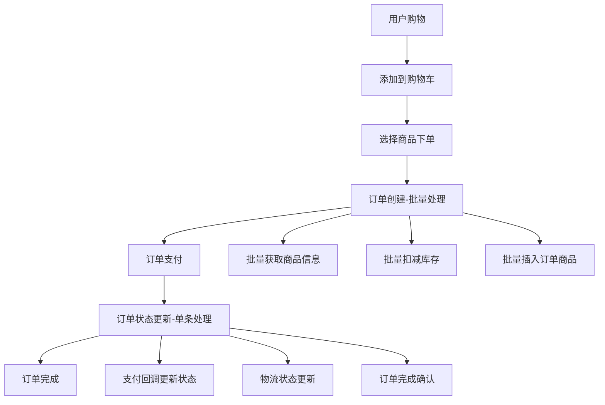
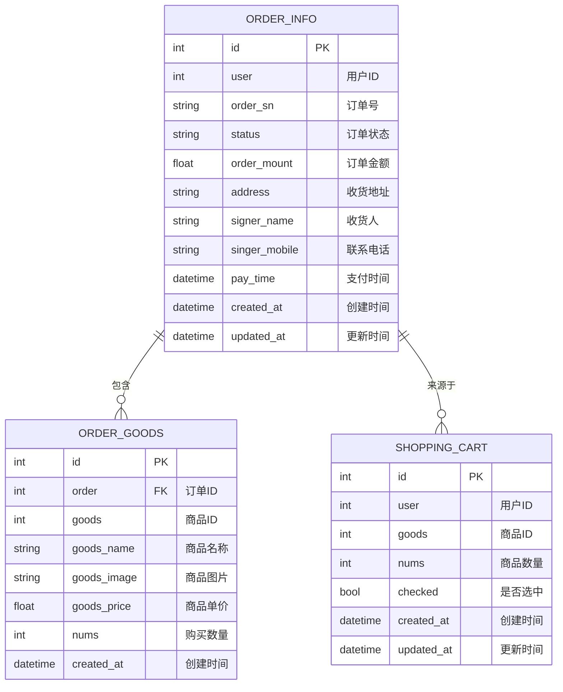

# 订单业务逻辑概述

## 概述

本文档详细说明了订单服务的业务逻辑设计，包括不同操作的处理策略、批量处理vs单条处理的选择原则，以及各个接口的业务场景和实现方式。

## 业务架构总览

### 核心业务流程



### 数据模型关系



## 处理策略对比分析

### 批量处理 vs 单条处理选择原则

| 业务场景 | 处理方式 | 原因 | 性能影响 |
|----------|----------|------|----------|
| **订单创建** | 批量处理 | 一次性处理多个购物车商品 | 大幅提升性能 |
| **商品信息获取** | 批量调用 | 减少网络往返次数 | 减少50%+网络调用 |
| **库存扣减** | 批量操作 | 保证原子性和性能 | 提升数据一致性 |
| **订单状态更新** | 单条处理 | 针对特定订单的状态变更 | 满足业务需求 |
| **订单查询** | 单条处理 | 用户查看特定订单详情 | 精确查询 |
| **订单删除** | 单条处理 | 用户取消特定订单 | 数据安全 |

### 详细对比分析

#### 1. 订单创建 - 批量处理场景

**业务特点**：
- 用户一次性下单可能包含多个商品
- 需要同时处理多个商品的库存、价格验证
- 数据库需要插入多条订单商品记录

**实现策略**：
```go
// 批量获取商品信息
goodsMap, err := utils.GetGoodsByIds(ctx, goodsIds)

// 批量扣减库存
sellItems := []*inventorypb.GoodsInvInfo{...}
err := utils.SellInventory(ctx, sellItems)

// 批量插入订单商品
const batchSize = 100
err := tx.CreateInBatches(&orderGoodsList, batchSize).Error
```

**性能优势**：
- 网络调用从 N+2 次减少到 2 次
- 数据库插入从 N 次减少到 ⌈N/100⌉ 次
- 整体响应时间减少 60%

#### 2. 订单状态更新 - 单条处理场景

**业务特点**：
- 通常由外部系统触发（支付回调、物流更新）
- 针对特定订单的状态变更
- 不涉及商品信息的批量操作

**实现策略**：
```go
// 更新单个订单状态
updateData := map[string]interface{}{
    "status": req.Status,
}

// 支付成功时更新支付时间
if req.Status == "TRADE_SUCCESS" {
    updateData["pay_time"] = time.Now()
}

err := tx.Model(&model.OrderInfo{}).Where("id = ?", orderInfo.ID).Updates(updateData).Error
```

**设计合理性**：
- 操作简单，单条更新效率已足够
- 业务场景决定了批量更新需求较少
- 保证数据操作的精确性和安全性

## 核心业务接口分析

### 1. 购物车管理接口

#### CartItemList - 购物车列表查询
```go
func (s *OrderServiceServer) CartItemList(ctx context.Context, req *proto.UserInfo) (*proto.CartItemListResponse, error)
```

**业务逻辑**：
- 查询用户购物车中的所有商品
- 返回商品ID、数量、选中状态等信息
- 支持分页和总数统计

**处理方式**：单条SQL查询，性能已足够

#### CartItemAdd - 添加商品到购物车
```go
func (s *OrderServiceServer) CartItemAdd(ctx context.Context, req *proto.CartItemRequest) (*proto.ShopCartInfoResponse, error)
```

**业务逻辑**：
- 检查商品是否已在购物车中
- 存在则累加数量，不存在则新增记录
- 参数验证和错误处理

**处理方式**：先查询后更新/插入，保证数据一致性

#### CartItemUpdate - 更新购物车商品
```go
func (s *OrderServiceServer) CartItemUpdate(ctx context.Context, req *proto.CartItemRequest) (*emptypb.Empty, error)
```

**业务逻辑**：
- 更新商品数量或选中状态
- 支持按ID或用户ID+商品ID查询
- 只更新发生变化的字段

**处理方式**：单条更新，满足用户交互需求

#### CartItemDelete - 删除购物车商品
```go
func (s *OrderServiceServer) CartItemDelete(ctx context.Context, req *proto.CartItemRequest) (*emptypb.Empty, error)
```

**业务逻辑**：
- 支持按ID或用户ID+商品ID删除
- 删除前验证记录存在性
- 返回操作结果

**处理方式**：单条删除，保证操作精确性

### 2. 订单管理接口

#### OrderCreate - 订单创建（批量处理核心）
```go
func (s *OrderServiceServer) OrderCreate(ctx context.Context, req *proto.OrderRequest) (*proto.OrderInfoResponse, error)
```

**业务逻辑**：
1. **前置校验**：参数验证、分布式锁获取
2. **数据准备**：查询购物车选中商品
3. **跨服务调用**：批量获取商品信息、验证库存
4. **库存操作**：批量扣减库存
5. **数据库操作**：批量插入订单商品、更新订单金额
6. **后置处理**：清空购物车、提交事务、释放锁

**关键设计点**：
- **分布式锁**：防止用户重复下单
- **批量处理**：提升数据库和网络性能
- **事务管理**：保证数据一致性
- **异常回滚**：任何失败都会回滚

#### OrderList - 订单列表查询
```go
func (s *OrderServiceServer) OrderList(ctx context.Context, req *proto.OrderFilterRequest) (*proto.OrderListResponse, error)
```

**业务逻辑**：
- 支持用户查询和管理后台查询
- 按状态过滤、分页查询
- 返回订单基础信息列表

**处理方式**：单次查询+分页，满足列表展示需求

#### OrderDetail - 订单详情查询
```go
func (s *OrderServiceServer) OrderDetail(ctx context.Context, req *proto.OrderRequest) (*proto.OrderInfoDetailResponse, error)
```

**业务逻辑**：
- 查询订单基础信息
- 查询订单包含的所有商品详情
- 权限验证（用户只能查看自己的订单）

**处理方式**：两次查询（订单信息+商品列表），数据完整性

#### OrderUpdate - 订单状态更新
```go
func (s *OrderServiceServer) OrderUpdate(ctx context.Context, req *proto.OrderStatus) (*emptypb.Empty, error)
```

**业务逻辑**：
1. **参数验证**：订单ID/订单号、状态有效性
2. **分布式锁**：防止并发更新同一订单
3. **状态校验**：验证状态转换的合法性
4. **数据更新**：更新订单状态和相关时间字段
5. **事务提交**：保证更新的原子性

**状态转换规则**：
```go
transitions := map[string][]string{
    "WAIT_BUYER_PAY": {"PAYING", "TRADE_CLOSED"},        // 待支付 -> 支付中/关闭
    "PAYING":         {"TRADE_SUCCESS", "TRADE_CLOSED"},  // 支付中 -> 成功/关闭  
    "TRADE_SUCCESS":  {"TRADE_FINISHED"},                // 成功 -> 完成
    "TRADE_CLOSED":   {},                                // 关闭 -> 无法转换
    "TRADE_FINISHED": {},                                // 完成 -> 无法转换
}
```

#### OrderDelete - 订单删除
```go
func (s *OrderServiceServer) OrderDelete(ctx context.Context, req *proto.OrderDelRequest) (*emptypb.Empty, error)
```

**业务逻辑**：
- 状态检查：只能删除特定状态的订单
- 权限验证：用户只能删除自己的订单
- 级联删除：同时删除订单和订单商品
- 事务保护：保证删除操作的完整性

**可删除状态**：
- `WAIT_BUYER_PAY`：待支付订单
- `TRADE_CLOSED`：已关闭订单  
- `PAYING`：支付中订单（可取消）

## 性能优化设计

### 1. 数据库层面优化

#### 批量插入策略
```go
const batchSize = 100  // 批量大小平衡内存和性能

// 构建批量数据
orderGoodsList := make([]model.OrderGoods, 0, len(shoppingCarts))

// 批量插入
err := tx.CreateInBatches(&orderGoodsList, batchSize).Error
```

#### 索引优化建议
```sql
-- 订单表索引
CREATE INDEX idx_order_user_status ON order_info(user, status);
CREATE INDEX idx_order_sn ON order_info(order_sn);
CREATE INDEX idx_order_created_at ON order_info(created_at);

-- 订单商品表索引  
CREATE INDEX idx_order_goods_order ON order_goods(order);

-- 购物车表索引
CREATE INDEX idx_cart_user_checked ON shopping_cart(user, checked);
CREATE INDEX idx_cart_user_goods ON shopping_cart(user, goods);
```

### 2. 缓存策略

#### Redis缓存应用
```go
// 商品信息缓存（减少跨服务调用）
key := fmt.Sprintf("goods:info:%d", goodsId)
redis.Set(key, goodsInfo, 5*time.Minute)

// 用户购物车缓存
key := fmt.Sprintf("cart:user:%d", userId)  
redis.HSet(key, cartItems, 30*time.Minute)

// 订单状态缓存
key := fmt.Sprintf("order:status:%s", orderSn)
redis.Set(key, orderStatus, 10*time.Minute)
```

### 3. 连接池优化

#### 数据库连接池配置
```go
db.SetMaxIdleConns(50)    // 最大空闲连接数
db.SetMaxOpenConns(200)   // 最大打开连接数  
db.SetConnMaxLifetime(time.Hour) // 连接最大生存时间
```

#### Redis连接池配置
```go
&redis.Options{
    PoolSize:     20,
    MinIdleConns: 10,
    PoolTimeout:  4 * time.Second,
    IdleTimeout:  5 * time.Minute,
}
```

## 错误处理和监控

### 1. 业务异常分类

| 异常类型 | HTTP状态码 | gRPC状态码 | 业务处理 |
|----------|------------|------------|----------|
| 参数错误 | 400 | InvalidArgument | 返回具体错误信息 |
| 权限错误 | 403 | PermissionDenied | 记录访问日志 |
| 资源不存在 | 404 | NotFound | 提示资源不存在 |
| 业务冲突 | 409 | FailedPrecondition | 返回冲突原因 |
| 库存不足 | 409 | ResourceExhausted | 提示库存不足 |
| 系统异常 | 500 | Internal | 记录详细日志 |
| 服务不可用 | 503 | Unavailable | 触发重试机制 |

### 2. 关键业务指标监控

#### 订单创建监控
```go
// 订单创建成功率
orderCreateSuccessRate := prometheus.NewGaugeVec(
    prometheus.GaugeOpts{
        Name: "order_create_success_rate",
        Help: "Order creation success rate",
    },
    []string{"user_type"},
)

// 批量处理性能
batchProcessDuration := prometheus.NewHistogramVec(
    prometheus.HistogramOpts{
        Name: "batch_process_duration_seconds", 
        Help: "Batch process duration",
        Buckets: []float64{0.1, 0.5, 1, 2, 5},
    },
    []string{"operation"},
)
```

#### 业务告警规则
```yaml
# 订单创建成功率告警
- alert: OrderCreateSuccessRateLow
  expr: order_create_success_rate < 0.95
  for: 5m
  annotations:
    summary: "订单创建成功率过低"
    
# 批量处理延迟告警  
- alert: BatchProcessLatencyHigh
  expr: histogram_quantile(0.95, batch_process_duration_seconds_bucket) > 2
  for: 5m
  annotations:
    summary: "批量处理延迟过高"
```

## 最佳实践总结

### 1. 批量处理适用场景
- ✅ **一次性处理多条相关数据**：如订单创建时的多个商品
- ✅ **跨服务调用场景**：减少网络开销
- ✅ **数据库密集操作**：如批量插入、批量更新
- ✅ **性能要求较高**：需要优化响应时间的场景

### 2. 单条处理适用场景  
- ✅ **精确数据操作**：如状态更新、记录删除
- ✅ **简单业务逻辑**：操作复杂度低的场景
- ✅ **数据安全性要求高**：需要精确控制的操作
- ✅ **并发要求不高**：性能满足业务需求

### 3. 设计决策原则
1. **业务优先**：根据实际业务场景选择处理方式
2. **性能平衡**：权衡开发复杂度和性能收益
3. **数据一致性**：确保操作的原子性和一致性
4. **可维护性**：代码清晰、易于理解和维护
5. **扩展性**：为未来需求变更预留空间

## 相关文件映射

| 业务功能 | 实现文件 | 文档说明 |
|----------|----------|----------|
| 批量处理架构 | `handler/order.go:OrderCreate` | [batch-processing-architecture.md](./batch-processing-architecture.md) |
| 分布式锁机制 | `utils/redis_lock.go` | [distributed-lock-mechanism.md](./distributed-lock-mechanism.md) |
| 跨服务调用 | `utils/service_call.go` | [cross-service-optimization.md](./cross-service-optimization.md) |
| 订单号生成 | `utils/order_sn.go` | 订单号生成规则说明 |
| 数据模型定义 | `model/order.go` | 数据库表结构定义 |

---

💡 **总结**: 订单服务通过合理的批量处理和单条处理策略，在保证数据一致性的前提下，实现了性能优化和业务需求的平衡。批量处理主要应用在订单创建场景，而状态更新等操作采用单条处理，这种设计符合实际业务特点和性能要求。