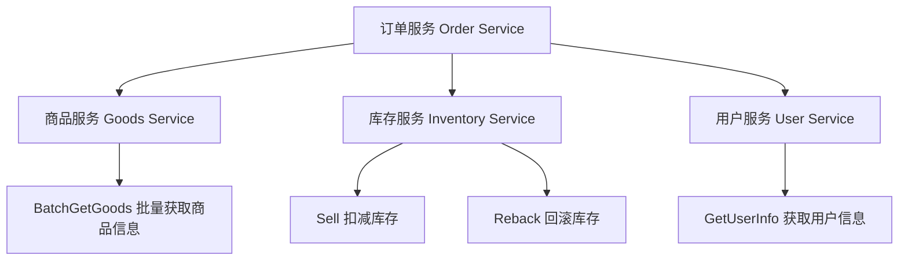
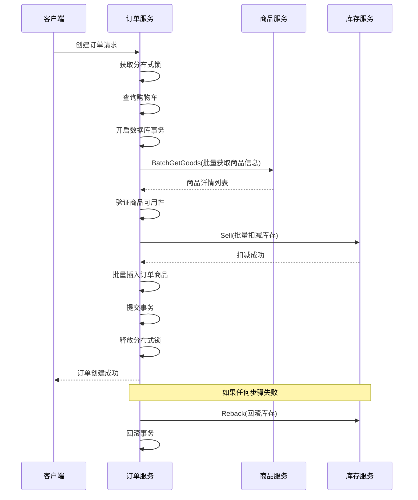

# 跨服务调用优化文档

## 概述

本文档详细说明了订单服务中跨服务调用的优化策略，包括批量接口使用、错误处理机制、性能优化和监控告警等内容。

## 跨服务调用架构

### 服务依赖关系



### 调用时序图



## 批量接口设计

### 1. 商品服务批量接口

#### 接口定义
```protobuf
service Goods {
    // 批量获取商品信息
    rpc BatchGetGoods(BatchGoodsIdInfo) returns (GoodsListResponse);
}

message BatchGoodsIdInfo {
    repeated int32 id = 1; // 商品ID列表
}

message GoodsListResponse {
    int32 total = 1;
    repeated GoodsInfoResponse data = 2;
}
```

#### 使用示例
```go
func GetGoodsByIds(ctx context.Context, goodsIds []int32) (map[int32]*goodspb.GoodsInfoResponse, error) {
    if global.GoodsClient == nil {
        return nil, fmt.Errorf("商品服务未连接")
    }

    goodsClient := goodspb.NewGoodsClient(global.GoodsClient)
    
    // 调用商品服务批量获取商品信息
    resp, err := goodsClient.BatchGetGoods(ctx, &goodspb.BatchGoodsIdInfo{
        Id: goodsIds,
    })
    if err != nil {
        global.Logger.Errorf("调用商品服务失败: %v", err)
        return nil, fmt.Errorf("获取商品信息失败: %w", err)
    }

    // 转换为map便于查找
    goodsMap := make(map[int32]*goodspb.GoodsInfoResponse)
    for _, good := range resp.Data {
        goodsMap[good.Id] = good
    }

    return goodsMap, nil
}
```

### 2. 库存服务批量接口

#### 批量扣减库存
```go
func SellInventory(ctx context.Context, sellItems []*inventorypb.GoodsInvInfo) error {
    if global.InventoryClient == nil {
        return fmt.Errorf("库存服务未连接")
    }

    inventoryClient := inventorypb.NewInventoryServiceClient(global.InventoryClient)
    
    // 调用库存服务扣减库存
    _, err := inventoryClient.Sell(ctx, &inventorypb.SellInfo{
        GoodsInvInfo: sellItems,
    })
    if err != nil {
        // 检查是否是库存不足的错误
        if st, ok := status.FromError(err); ok {
            if st.Code() == codes.ResourceExhausted {
                global.Logger.Warnf("库存不足: %v", err)
                return fmt.Errorf("库存不足")
            }
        }
        global.Logger.Errorf("库存扣减失败: %v", err)
        return fmt.Errorf("库存扣减失败: %w", err)
    }

    global.Logger.Info("库存扣减成功")
    return nil
}
```

#### 批量回滚库存
```go
func RebackInventory(ctx context.Context, rebackItems []*inventorypb.GoodsInvInfo) error {
    if global.InventoryClient == nil {
        return fmt.Errorf("库存服务未连接")
    }

    inventoryClient := inventorypb.NewInventoryServiceClient(global.InventoryClient)
    
    // 调用库存服务归还库存
    _, err := inventoryClient.Reback(ctx, &inventorypb.SellInfo{
        GoodsInvInfo: rebackItems,
    })
    if err != nil {
        global.Logger.Errorf("库存归还失败: %v", err)
        return fmt.Errorf("库存归还失败: %w", err)
    }

    global.Logger.Info("库存归还成功")
    return nil
}
```

## 性能优化策略

### 1. 批量调用优化

#### 减少网络RTT
- **批量获取商品信息**: 一次调用获取所有商品详情
- **批量扣减库存**: 一次调用处理所有库存变更
- **避免N+1问题**: 不要在循环中进行单次调用

#### 批量大小控制
```go
const (
    MaxBatchSize = 100 // 最大批量大小
)

func splitIntoBatches(items []int32, batchSize int) [][]int32 {
    var batches [][]int32
    for i := 0; i < len(items); i += batchSize {
        end := i + batchSize
        if end > len(items) {
            end = len(items)
        }
        batches = append(batches, items[i:end])
    }
    return batches
}
```

### 2. 连接池优化

#### gRPC连接配置
```go
func NewGRPCConn(target string) (*grpc.ClientConn, error) {
    return grpc.Dial(target,
        grpc.WithInsecure(),
        grpc.WithKeepaliveParams(keepalive.ClientParameters{
            Time:                10 * time.Second, // 发送keepalive ping的间隔
            Timeout:             3 * time.Second,  // 等待keepalive ping回复的超时时间
            PermitWithoutStream: true,             // 没有活动流时也发送keepalive ping
        }),
        grpc.WithDefaultCallOptions(
            grpc.MaxCallRecvMsgSize(4*1024*1024), // 4MB
            grpc.MaxCallSendMsgSize(4*1024*1024), // 4MB
        ),
    )
}
```

### 3. 超时控制

#### 上下文超时设置
```go
func GetGoodsByIds(ctx context.Context, goodsIds []int32) (map[int32]*goodspb.GoodsInfoResponse, error) {
    // 设置调用超时
    ctx, cancel := context.WithTimeout(ctx, 5*time.Second)
    defer cancel()
    
    // ... 调用逻辑
}
```

#### 分层超时策略
```go
const (
    // 服务间调用超时时间
    GoodsServiceTimeout     = 5 * time.Second
    InventoryServiceTimeout = 3 * time.Second
    UserServiceTimeout      = 2 * time.Second
    
    // 总体业务超时时间
    OrderCreateTimeout = 30 * time.Second
)
```

## 错误处理机制

### 1. 错误分类

#### gRPC状态码处理
```go
func handleGRPCError(err error) error {
    if st, ok := status.FromError(err); ok {
        switch st.Code() {
        case codes.NotFound:
            return fmt.Errorf("资源不存在: %s", st.Message())
        case codes.ResourceExhausted:
            return fmt.Errorf("资源不足: %s", st.Message())
        case codes.DeadlineExceeded:
            return fmt.Errorf("调用超时: %s", st.Message())
        case codes.Unavailable:
            return fmt.Errorf("服务不可用: %s", st.Message())
        default:
            return fmt.Errorf("服务调用失败: %s", st.Message())
        }
    }
    return err
}
```

### 2. 重试机制

#### 指数退避重试
```go
func callWithRetry(ctx context.Context, operation func() error, maxRetries int) error {
    var err error
    for i := 0; i < maxRetries; i++ {
        err = operation()
        if err == nil {
            return nil
        }
        
        // 检查是否为可重试的错误
        if !isRetriableError(err) {
            return err
        }
        
        if i < maxRetries-1 {
            // 指数退避
            backoff := time.Duration(math.Pow(2, float64(i))) * 100 * time.Millisecond
            select {
            case <-ctx.Done():
                return ctx.Err()
            case <-time.After(backoff):
            }
        }
    }
    return err
}

func isRetriableError(err error) bool {
    if st, ok := status.FromError(err); ok {
        switch st.Code() {
        case codes.Unavailable, codes.DeadlineExceeded, codes.ResourceExhausted:
            return true
        default:
            return false
        }
    }
    return false
}
```

### 3. 熔断机制

#### 简单熔断器实现
```go
type CircuitBreaker struct {
    failureCount    int64
    lastFailureTime time.Time
    threshold       int64
    timeout         time.Duration
    state           State
    mutex           sync.RWMutex
}

type State int

const (
    StateClosed State = iota
    StateOpen
    StateHalfOpen
)

func (cb *CircuitBreaker) Call(operation func() error) error {
    cb.mutex.RLock()
    state := cb.state
    failureCount := cb.failureCount
    cb.mutex.RUnlock()
    
    if state == StateOpen {
        if time.Since(cb.lastFailureTime) > cb.timeout {
            cb.setState(StateHalfOpen)
        } else {
            return fmt.Errorf("熔断器开启，拒绝调用")
        }
    }
    
    err := operation()
    cb.onResult(err == nil)
    return err
}
```

## 监控与告警

### 1. 关键指标

#### 性能指标
- **调用延迟**: P50, P90, P95, P99延迟时间
- **QPS**: 每秒查询数
- **成功率**: 调用成功次数/总调用次数
- **错误率**: 按错误类型统计的错误比例

#### 业务指标
- **批量大小分布**: 统计批量调用的商品数量分布
- **重试次数**: 平均重试次数和重试成功率
- **超时情况**: 超时调用的比例和原因

### 2. 监控实现

#### Prometheus指标定义
```go
var (
    // RPC调用计数器
    rpcCallsTotal = prometheus.NewCounterVec(
        prometheus.CounterOpts{
            Name: "rpc_calls_total",
            Help: "Total number of RPC calls",
        },
        []string{"service", "method", "status"},
    )
    
    // RPC调用延迟直方图
    rpcCallDuration = prometheus.NewHistogramVec(
        prometheus.HistogramOpts{
            Name: "rpc_call_duration_seconds",
            Help: "RPC call duration in seconds",
            Buckets: prometheus.DefBuckets,
        },
        []string{"service", "method"},
    )
    
    // 批量大小直方图
    batchSizeHistogram = prometheus.NewHistogramVec(
        prometheus.HistogramOpts{
            Name: "batch_size",
            Help: "Batch size distribution",
            Buckets: []float64{1, 5, 10, 20, 50, 100, 200},
        },
        []string{"service", "operation"},
    )
)
```

#### 指标记录
```go
func recordMetrics(service, method string, duration time.Duration, err error) {
    status := "success"
    if err != nil {
        status = "error"
    }
    
    rpcCallsTotal.WithLabelValues(service, method, status).Inc()
    rpcCallDuration.WithLabelValues(service, method).Observe(duration.Seconds())
}
```

### 3. 告警规则

#### Prometheus告警规则
```yaml
groups:
- name: cross_service_alerts
  rules:
  - alert: HighErrorRate
    expr: rate(rpc_calls_total{status="error"}[5m]) / rate(rpc_calls_total[5m]) > 0.05
    for: 2m
    labels:
      severity: warning
    annotations:
      summary: "跨服务调用错误率过高"
      description: "服务 {{ $labels.service }} 的 {{ $labels.method }} 方法错误率超过5%"
  
  - alert: HighLatency
    expr: histogram_quantile(0.95, rate(rpc_call_duration_seconds_bucket[5m])) > 1
    for: 5m
    labels:
      severity: warning
    annotations:
      summary: "跨服务调用延迟过高"
      description: "服务 {{ $labels.service }} 的 {{ $labels.method }} 方法P95延迟超过1秒"
```

## 最佳实践

### 1. 接口设计

#### 批量接口设计原则
- **支持批量操作**: 避免N+1问题
- **合理的批量大小限制**: 防止请求过大
- **幂等性**: 支持安全重试
- **向后兼容**: 接口变更要保持兼容性

#### 错误码统一
```go
const (
    // 业务错误码
    ErrCodeGoodsNotFound     = 10001 // 商品不存在
    ErrCodeInsufficientStock = 10002 // 库存不足
    ErrCodeServiceUnavailable = 10003 // 服务不可用
)
```

### 2. 性能优化

#### 并发调用
```go
func GetMultiServiceData(ctx context.Context, goodsIds []int32, userID int32) (*CombinedData, error) {
    var wg sync.WaitGroup
    var goodsErr, userErr error
    var goodsData map[int32]*goodspb.GoodsInfoResponse
    var userData *userpb.UserInfoResponse
    
    // 并发调用多个服务
    wg.Add(2)
    
    go func() {
        defer wg.Done()
        goodsData, goodsErr = GetGoodsByIds(ctx, goodsIds)
    }()
    
    go func() {
        defer wg.Done()
        userData, userErr = GetUserInfo(ctx, userID)
    }()
    
    wg.Wait()
    
    if goodsErr != nil {
        return nil, goodsErr
    }
    if userErr != nil {
        return nil, userErr
    }
    
    return &CombinedData{
        Goods: goodsData,
        User:  userData,
    }, nil
}
```

### 3. 服务治理

#### 服务发现
```go
func newGoodsClient() (goodspb.GoodsClient, error) {
    // 从注册中心获取服务地址
    endpoint, err := discovery.GetService("goods-service")
    if err != nil {
        return nil, fmt.Errorf("服务发现失败: %w", err)
    }
    
    conn, err := grpc.Dial(endpoint,
        grpc.WithInsecure(),
        grpc.WithBalancerName("round_robin"), // 负载均衡
    )
    if err != nil {
        return nil, fmt.Errorf("连接服务失败: %w", err)
    }
    
    return goodspb.NewGoodsClient(conn), nil
}
```

#### 健康检查
```go
func healthCheck(ctx context.Context, client goodspb.GoodsClient) error {
    ctx, cancel := context.WithTimeout(ctx, 3*time.Second)
    defer cancel()
    
    // 调用健康检查接口
    _, err := client.HealthCheck(ctx, &emptypb.Empty{})
    return err
}
```

## 故障排查

### 常见问题

1. **调用超时**
   - 检查网络连通性
   - 确认服务是否正常运行
   - 调整超时时间设置

2. **连接池耗尽**
   - 检查连接池配置
   - 确认连接是否正确释放
   - 监控连接数使用情况

3. **序列化错误**
   - 检查protobuf版本兼容性
   - 确认消息格式是否正确
   - 查看错误日志详情

### 调试工具

```bash
# 使用grpcurl测试接口
grpcurl -plaintext -d '{"id": [1,2,3]}' localhost:8081 Goods/BatchGetGoods

# 查看服务健康状态
grpcurl -plaintext localhost:8081 grpc.health.v1.Health/Check

# 监控网络连接
netstat -an | grep :8081
```

## 相关文件

- `order_srv/utils/service_call.go`: 跨服务调用工具类
- `order_srv/proto/goods/`: 商品服务协议定义
- `order_srv/proto/inventory/`: 库存服务协议定义
- `order_srv/initialize/service_client.go`: 服务客户端初始化